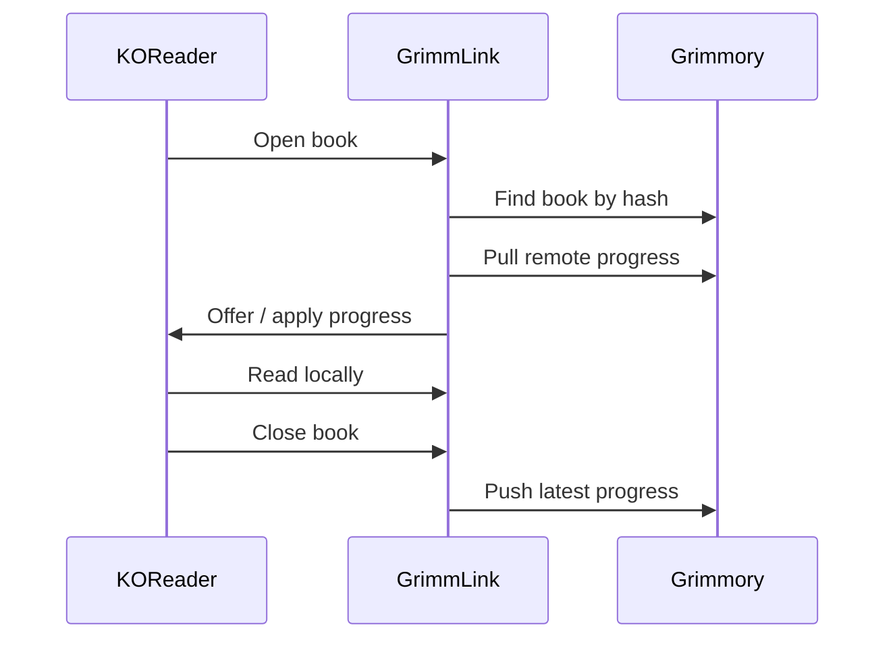
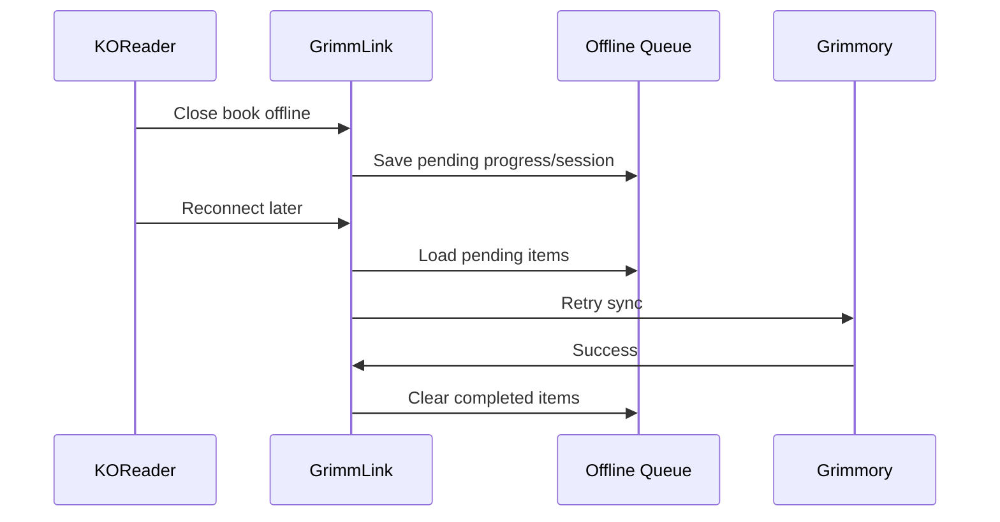
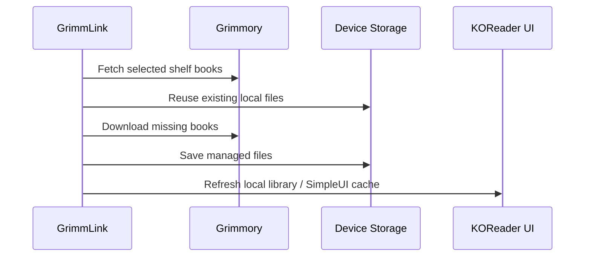

<div align="center">

# GrimmLink

### KOReader Companion for Grimmory

**Sync reading progress, sessions, shelves, metadata, and downloaded books between KOReader and Grimmory — without breaking your reading flow.**

<br />


<br />

[Features](#features) • [Installation](#installation) • [Configuration](#configuration) • [How It Works](#how-it-works) • [Development](#development) • [Roadmap](#roadmap)

</div>

---

## What is GrimmLink?

**GrimmLink** is a KOReader plugin built for readers who use **Grimmory** as their personal library server.

It connects your e-reader to Grimmory so your reading progress, reading sessions, shelves, downloaded books, and selected metadata can move with you across devices.

Open a book in KOReader. Read offline. Close the book. Reconnect later. GrimmLink quietly handles the sync work in the background.

> GrimmLink is designed for real e-reader usage: unstable Wi-Fi, long reading sessions, large libraries, local servers, remote servers, and devices that are not always online.

---

## Why GrimmLink?

Most reading sync tools solve only one part of the problem: progress.

GrimmLink aims to become the full KOReader companion layer for Grimmory:

- **Progress sync** for KOReader-native reading positions
- **Reading session sync** for reading history and stats
- **Shelf sync** for selected Grimmory shelves
- **Magic Shelf support** for dynamic server-side collections
- **Offline queue** for unreliable network conditions
- **Local book downloads** directly from Grimmory
- **Metadata sync** for ratings, annotations, and bookmarks
- **Diagnostics and backup tools** for real-world debugging

---

## Features

### Reading Progress Sync

GrimmLink can push and pull reading progress between KOReader and Grimmory.

| Capability | Status |
|---|---:|
| Pull progress when opening a book | ✅ |
| Push progress when closing a book | ✅ |
| Manual push / pull | ✅ |
| Conflict handling | ✅ |
| Fixed-page format support | ✅ |
| Reflowable format support | ✅ |
| Offline progress queue | ✅ |

Supported fixed-page formats include:

```text
PDF, CBZ, CBR, CB7, DJVU
```

Supported reflowable formats include:

```text
EPUB, MOBI, AZW, AZW3, FB2, HTML, TXT, DOCX
```

---

### Reading Sessions

GrimmLink tracks reading activity and sends reading sessions to Grimmory.

It supports:

- session start / end tracking
- duration calculation
- start and end progress
- minimum session duration threshold
- batch upload for pending sessions
- historical import from KOReader statistics data

This allows Grimmory to understand not only **where** you are in a book, but also **how** you read.

---

### Shelf Sync

Bring selected Grimmory shelves into KOReader.

GrimmLink supports both regular shelves and Magic Shelves:

| Shelf Feature | Status |
|---|---:|
| Regular shelf sync | ✅ |
| Magic shelf sync | ✅ |
| Regular + Magic sync | ✅ |
| Download books from Grimmory | ✅ |
| Reuse existing downloaded files | ✅ |
| Fast sync cache | ✅ |
| Cancel long sync jobs | ✅ |
| Free-space safety checks | ✅ |
| Local cleanup for removed shelf books | ✅ |
| SimpleUI bookinfo refresh | ✅ |

Shelf sync is designed to keep Grimmory as the source of truth while making selected books available locally on the device.

---

### Safe Delete Policy

GrimmLink is designed to be conservative with deletion.

| Action | Result |
|---|---|
| Remove a book from a KOReader synced shelf | Removes local shelf mapping and the local downloaded copy managed by GrimmLink |
| Remove a book from a Grimmory shelf | Removes it from the synced KOReader shelf on the next sync |
| Delete from Grimmory library | Not performed by GrimmLink |
| Delete arbitrary user files | Not performed by GrimmLink |

GrimmLink should only clean up local files that were downloaded and managed by GrimmLink.

---

### Offline Queue

E-readers are not always online. GrimmLink expects that.

When the network is unavailable, GrimmLink can queue:

- progress updates
- reading sessions
- metadata changes
- shelf removal events

Pending items can be retried later when the device reconnects.

---

### Metadata Sync

GrimmLink includes a metadata sync layer for richer reading data.

Supported metadata areas:

- ratings
- annotations
- bookmarks

Metadata sync can be enabled separately from core progress and shelf sync.

---

### Local + Remote Server URLs

GrimmLink supports both a local Grimmory URL and a remote Grimmory URL.

Typical setup:

```text
Local URL  → http://192.168.x.x:6060
Remote URL → https://your-domain.example.com
```

This is useful when Grimmory is hosted at home but also exposed through a remote tunnel, reverse proxy, or public endpoint.

> Note: KOReader does not reliably expose Wi-Fi SSID information across all devices. `home_ssid` should be treated as an optional note / diagnostic hint, not as a reliable automatic routing mechanism.

---

### Diagnostics, Backup, and Maintenance

GrimmLink includes maintenance tools for development and real-device testing:

- connection diagnostics
- local settings backup
- diagnostics bundle export
- debug logging
- file logging
- pending queue inspection
- historical reading session import
- update checks

These tools are especially useful when testing on Android-based e-readers, iReader devices, Kobo devices, or desktop KOReader builds.

---

## Installation

### 1. Download the plugin

Download the latest `grimmlink.koplugin.zip` from the release page.

### 2. Extract the plugin

After extraction, the folder should look like this:

```text
grimmlink.koplugin/
├── main.lua
├── _meta.lua
├── plugin_version.lua
├── grimmlink_api_client.lua
├── grimmlink_database.lua
├── grimmlink_shelf_sync.lua
└── ...
```

### 3. Copy to KOReader plugins folder

Copy the entire folder into KOReader's `plugins` directory.

Common paths:

```text
Android:
/sdcard/koreader/plugins/grimmlink.koplugin

Kobo:
.adds/koreader/plugins/grimmlink.koplugin

Linux desktop:
~/.config/koreader/plugins/grimmlink.koplugin
```

### 4. Restart KOReader

Restart KOReader completely.

Then open:

```text
KOReader → Tools / Plugins → GrimmLink
```

---

## Configuration

Open the GrimmLink settings menu and configure the connection to your Grimmory server.

### Required settings

| Setting | Description |
|---|---|
| Server URL / Local URL | Your Grimmory server URL |
| Username | Grimmory / KOReader companion username |
| Password / Auth key | Grimmory / KOReader companion password or key |
| Device name | Display name for this KOReader device |

### Recommended settings

| Setting | Recommended |
|---|---:|
| Auto pull on open | Enabled |
| Auto push on close | Enabled |
| Offline queue | Enabled |
| Ask before Wi-Fi sync | Enabled for e-readers |
| Shelf fast sync | Enabled |
| Refresh SimpleUI bookinfo after shelf sync | Enabled if using SimpleUI |

### Optional shelf settings

| Setting | Description |
|---|---|
| Regular shelf sync | Sync one selected Grimmory shelf |
| Magic shelf sync | Sync one selected Magic Shelf |
| Separate Magic download directory | Store Magic Shelf downloads separately |
| Use original filename | Keep server-provided filenames when possible |
| Two-way shelf delete sync | Sync local shelf removals back to Grimmory shelf membership |

---

## How It Works

### Progress flow



### Offline flow



### Shelf sync flow



---

## Grimmory API Usage

GrimmLink communicates with Grimmory through KOReader companion endpoints.

Core endpoint groups include:

```text
/api/koreader/users/auth
/api/koreader/books/by-hash/{hash}
/api/koreader/syncs/progress
/api/koreader/syncs/progress/{hash}
/api/v1/reading-sessions
/api/v1/reading-sessions/batch
/api/koreader/syncs/metadata
/api/koreader/shelves
/api/koreader/shelves/{type}/{shelfId}/books
/api/koreader/books/{bookId}/download
/api/koreader/books/read-statuses
/api/koreader/books/{bookId}/status
/api/koreader/books/{bookId}/pdf-progress
```

Authentication uses KOReader companion-style headers:

```text
x-auth-user
x-auth-key
```

---

## Project Structure

```text
grimmlink.koplugin/
├── main.lua                               # KOReader plugin entry point
├── _meta.lua                              # KOReader plugin metadata
├── plugin_version.lua                     # Version/build metadata
├── grimmlink_api_client.lua               # Grimmory API client
├── grimmlink_connection_controller.lua    # Connection setup and tests
├── grimmlink_constants.lua                # Defaults and shared constants
├── grimmlink_database.lua                 # Local SQLite storage and queues
├── grimmlink_diagnostics_controller.lua   # Diagnostics, backup, debugging
├── grimmlink_lifecycle_controller.lua     # Open/close/resume lifecycle hooks
├── grimmlink_magic_shelf_controller.lua   # Magic Shelf UI/controller
├── grimmlink_menu_builder.lua             # Settings/menu UI
├── grimmlink_metadata_controller.lua      # Metadata sync orchestration
├── grimmlink_metadata_extractor.lua       # KOReader metadata extraction
├── grimmlink_pending_sync.lua             # Pending queue sync engine
├── grimmlink_progress_controller.lua      # Progress sync logic
├── grimmlink_session_controller.lua       # Reading session tracking
├── grimmlink_shelf_controller.lua         # Shelf controller/UI actions
├── grimmlink_shelf_sync.lua               # Shelf sync planning/download/cleanup
├── grimmlink_updater.lua                  # Release/update checker
├── grimmlink_util.lua                     # Shared helpers
└── test/                                  # Test suite
```

---

## Development

### Run tests

This project includes Lua test specs under `test/`.

Typical command:

```bash
busted test
```

Useful test areas:

```text
test/api_client_spec.lua
test/grimmlink_database_spec.lua
test/grimmlink_deletion_spec.lua
test/grimmlink_matching_spec.lua
test/grimmlink_metadata_extractor_spec.lua
test/grimmlink_pending_sync_spec.lua
test/grimmlink_progress_sync_spec.lua
test/shelf_sync_spec.lua
test/updater_spec.lua
```

### Real-device testing checklist

Before tagging a stable release, test on at least one real KOReader device:

- install plugin from a clean KOReader profile
- connect to Grimmory server
- authenticate successfully
- open a matched book
- pull remote progress
- read and push local progress
- read offline and confirm queue retry
- sync a small shelf
- sync a large shelf
- cancel a long shelf sync
- remove a book from a synced shelf
- confirm server library files are not deleted
- restart KOReader and verify state is preserved

---

## Roadmap

GrimmLink is actively evolving. Current focus areas:

- harden large shelf sync on low-power e-readers
- improve async download behavior across Android/e-ink devices
- strengthen pending queue handling for edge cases
- improve stale-file detection when server book files change
- expand metadata sync reliability across formats
- polish diagnostics and credential redaction
- refine release/update workflow

---

## Known Notes

- KOReader may not expose Wi-Fi SSID reliably on every device, so network routing should not depend on SSID detection.
- Some devices may not include `curl` or `wget`; download behavior should be tested on target hardware.
- Large shelves should be tested on real devices, not only desktop KOReader.
- Metadata and annotation behavior can vary by book format.

---

## Version

```text
Version: v1.4.11
Type: release
Commit: 461dc9e
Build: 2026-06-03T10:44:24+07:00
```

---

## License

Add your project license here.

Recommended options:

- MIT for maximum openness
- GPL-compatible license if you want stronger copyleft alignment
- Project-specific license if Grimmory integration requires one

---

<div align="center">

**GrimmLink**  
_Read in KOReader. Sync with Grimmory. Keep your library moving._

</div>
