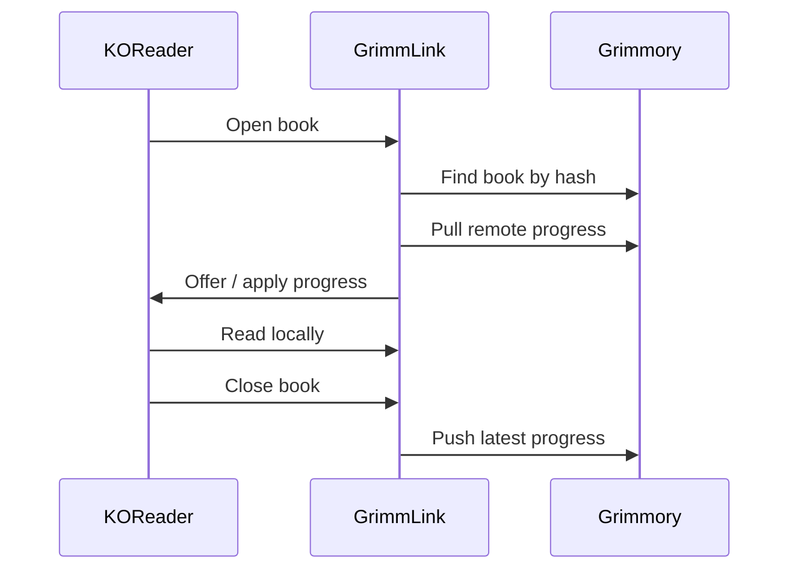
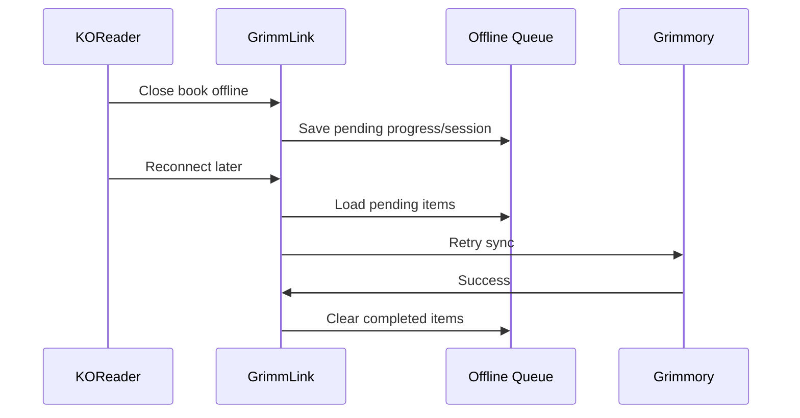
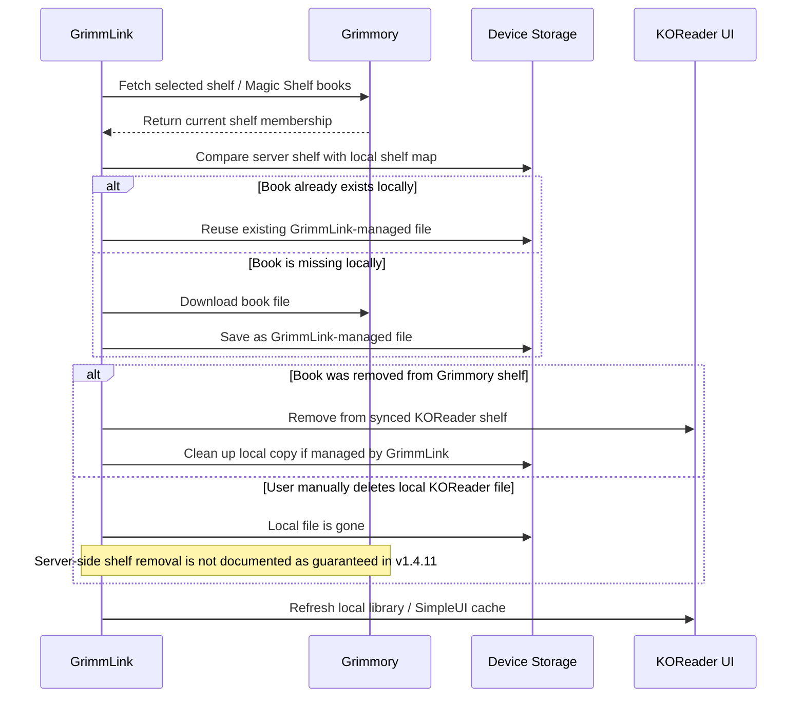

<h1 align="center">📚 GrimmLink</h1>

<h3 align="center">✨ KOReader Companion for the 0xstillb Grimmory Fork</h3>

<p align="center">
  <strong>🔄 Sync reading progress, ⏱️ sessions, 🗂️ shelves, 📝 metadata, and 📥 downloaded books between KOReader and <a href="https://github.com/0xstillb/grimmory">0xstillb/grimmory</a> — without breaking your reading flow.</strong>
</p>

<p align="center">
  
  
  
  
</p>

<p align="center">
  <a href="#features">✨ Features</a> ·
  <a href="#installation">🚀 Installation</a> ·
  <a href="#configuration">⚙️ Configuration</a> ·
  <a href="#how-it-works">🔄 How It Works</a> ·
  <a href="#development">🛠️ Development</a> ·
  <a href="#roadmap">🧭 Roadmap</a>
</p>

<p align="center">
  <strong>📍 Progress Sync</strong> ·
  <strong>🗂️ Shelf Sync</strong> ·
  <strong>🪄 Magic Shelf</strong> ·
  <strong>📦 Offline Queue</strong> ·
  <strong>🧰 Diagnostics</strong>
</p>

---

> ✅ **GitHub-ready:** this README intentionally uses Unicode emoji in headings, navigation, feature cards, notes, and flow sections for a more polished project landing page.

## 👋 What is GrimmLink?

**GrimmLink** is a KOReader plugin built for readers who use the **[`0xstillb/grimmory`](https://github.com/0xstillb/grimmory) fork** as their personal library server.

It connects your e-reader to Grimmory so your reading progress, reading sessions, shelves, downloaded books, and selected metadata can move with you across devices.

Open a book in KOReader. Read offline. Close the book. Reconnect later. GrimmLink quietly handles the sync work in the background.

> 💡 GrimmLink is designed for real e-reader usage: unstable Wi-Fi, long reading sessions, large libraries, local servers, remote servers, and devices that are not always online.

---

## 🎯 Why GrimmLink?

Most reading sync tools solve only one part of the problem: progress.

GrimmLink aims to become the full KOReader companion layer for Grimmory:

- 📍 **Progress sync** for KOReader-native reading positions
- ⏱️ **Reading session sync** for reading history and stats
- 🗂️ **Shelf sync** for selected Grimmory shelves
- 🪄 **Magic Shelf support** for dynamic server-side collections
- 📦 **Offline queue** for unreliable network conditions
- 📥 **Local book downloads** directly from Grimmory
- 📝 **Metadata sync** for ratings, annotations, and bookmarks
- 🧰 **Diagnostics and backup tools** for real-world debugging

---

<a id="features"></a>

## ✨ Features

### 📍 Reading Progress Sync

GrimmLink can push and pull reading progress between KOReader and Grimmory.

| Capability | Status |
|---|---:|
| Pull progress when opening a book | ✅ |
| Push progress when closing a book | ✅ |
| Manual push / pull | ✅ |
| Conflict handling | ✅ |
| Fixed-page format support | ✅ |
| Reflowable format support | ✅ |
| Offline progress queue | ✅ |

Supported fixed-page formats include:

```text
PDF, CBZ, CBR, CB7, DJVU
```

Supported reflowable formats include:

```text
EPUB, MOBI, AZW, AZW3, FB2, HTML, TXT, DOCX
```

---

### ⏱️ Reading Sessions

GrimmLink tracks reading activity and sends reading sessions to Grimmory.

It supports:

- 🟢 session start / end tracking
- ⏳ duration calculation
- 📊 start and end progress
- 🧮 minimum session duration threshold
- 📦 batch upload for pending sessions
- 🕰️ historical import from KOReader statistics data

This allows Grimmory to understand not only **where** you are in a book, but also **how** you read.

---

### 🗂️ Shelf Sync

Bring selected Grimmory shelves into KOReader.

GrimmLink supports both regular shelves and Magic Shelves:

| Shelf Feature | Status |
|---|---:|
| Regular shelf sync | ✅ |
| Magic shelf sync | ✅ |
| Regular + Magic sync | ✅ |
| Download books from Grimmory | ✅ |
| Reuse existing downloaded files | ✅ |
| Fast sync cache | ✅ |
| Cancel long sync jobs | ✅ |
| Free-space safety checks | ✅ |
| Local cleanup for removed shelf books | ✅ |
| Async → blocking download fallback | ✅ |
| Batched pending-removal drain for large shelves | ✅ |
| SimpleUI bookinfo refresh | ✅ |

Shelf sync is designed to keep Grimmory as the source of truth while making selected books available locally on the device.

---

### 🗑️ Safe Delete Policy

GrimmLink is intentionally conservative with deletion.

| Action | Result |
|---|---|
| 🗂️ Book removed from a Grimmory shelf | Removed from the synced KOReader shelf on the next sync |
| 🧹 Local cleanup after shelf removal | Removes only GrimmLink-managed local copies inside managed download roots |
| 🚫 Delete from Grimmory library | Not performed by GrimmLink |
| 🚫 Delete arbitrary user files | Not performed by GrimmLink |
| ⚠️ User manually deletes/removes a local KOReader file | Not documented as guaranteed server-side shelf removal unless the device hook is implemented and tested |

> ⚠️ Code review note for **v1.4.11**: the plugin includes a `pending_shelf_removals` table, `removeBookFromShelf()` API call, and pending-removal retry processor. However, this review did **not** confirm an active KOReader file-manager delete hook that automatically converts a user-initiated local delete into a queued Grimmory shelf removal. Do not document local-delete → Grimmory shelf removal as guaranteed until that hook is implemented and tested.

---

### 📦 Offline Queue

E-readers are not always online. GrimmLink expects that.

When the network is unavailable, GrimmLink can queue:

- 📍 progress updates
- ⏱️ reading sessions
- 📝 metadata changes
- 🗂️ supported shelf-removal API retries

Pending sync replays these queues in smaller follow-up rounds after resume or reconnect, and a failure in one queue no longer prevents the others from retrying.

Pending items can be retried later when the device reconnects.

---

### 📝 Metadata Sync

GrimmLink includes a metadata sync layer for richer reading data.

Supported metadata areas:

- ⭐ ratings
- ✍️ annotations
- 🔖 bookmarks

Metadata sync can be enabled separately from core progress and shelf sync.
`Pull Remote Metadata Now` resolves the open/current book, applies supported
items without duplicating local annotations or bookmarks, and reports why any
unsupported or disabled items were skipped. Manual pulls run in the background
and show connecting, receiving, and applying stages so slow network requests do
not block the KOReader interface.

---

### 🌐 Local + Remote Server URLs

GrimmLink supports both a local Grimmory URL and a remote Grimmory URL.

Typical setup:

```text
Local URL  → http://192.168.x.x:6060
Remote URL → https://your-domain.example.com
```

This is useful when Grimmory is hosted at home but also exposed through a remote tunnel, reverse proxy, or public endpoint.

> 📡 Note: KOReader does not reliably expose Wi-Fi SSID information across all devices. `home_ssid` should be treated as an optional note / diagnostic hint, not as a reliable automatic routing mechanism.

---

### 🧰 Diagnostics, Backup, and Maintenance

GrimmLink includes maintenance tools for development and real-device testing:

- 🔌 connection diagnostics
- 💾 local settings backup
- 🧪 diagnostics bundle export
- 🐞 debug logging
- 📄 file logging
- 📦 pending queue inspection
- 🕰️ historical reading session import
- ⬆️ update checks

These tools are especially useful when testing on Android-based e-readers, iReader devices, Kobo devices, or desktop KOReader builds.

---

<a id="installation"></a>

## 🚀 Installation

### 1. 📥 Download the plugin

Download the latest `grimmlink.koplugin.zip` from the release page.

### 2. 📂 Extract the plugin

After extraction, the folder should look like this:

```text
grimmlink.koplugin/
├── main.lua
├── _meta.lua
├── plugin_version.lua
├── grimmlink_api_client.lua
├── grimmlink_database.lua
├── grimmlink_shelf_sync.lua
└── ...
```

### 3. 📲 Copy to KOReader plugins folder

Copy the entire folder into KOReader's `plugins` directory.

Common paths:

```text
Android:
/sdcard/koreader/plugins/grimmlink.koplugin

Kobo:
.adds/koreader/plugins/grimmlink.koplugin

Linux desktop:
~/.config/koreader/plugins/grimmlink.koplugin
```

### 4. 🔄 Restart KOReader

Restart KOReader completely.

Then open:

```text
KOReader → Tools / Plugins → GrimmLink
```

---

<a id="configuration"></a>

## ⚙️ Configuration

Open the GrimmLink settings menu and configure the connection to your Grimmory server.

> 🔗 GrimmLink targets the **[`0xstillb/grimmory`](https://github.com/0xstillb/grimmory) fork** and its KOReader companion endpoints.

### 🔐 Required settings

| Setting | Description |
|---|---|
| Server URL / Local URL | Your `0xstillb/grimmory` server URL |
| Username | Grimmory / KOReader companion username |
| Password / Auth key | Grimmory / KOReader companion password or key |
| Device name | Display name for this KOReader device |

### ✅ Recommended settings

| Setting | Recommended |
|---|---:|
| Auto pull on open | Enabled |
| Auto push on close | Enabled |
| Offline queue | Enabled |
| Ask before Wi-Fi sync | Enabled for e-readers |
| Shelf fast sync | Enabled |
| Refresh SimpleUI bookinfo after shelf sync | Enabled if using SimpleUI |

### 🗂️ Optional shelf settings

| Setting | Description |
|---|---|
| Regular shelf sync | Sync one selected Grimmory shelf |
| Magic shelf sync | Sync one selected Magic Shelf |
| Separate Magic download directory | Store Magic Shelf downloads separately |
| Use original filename | Keep server-provided filenames when possible |
| Two-way shelf delete sync | Experimental / implementation-dependent; do not rely on local-delete → server shelf removal unless verified on device |

---

<a id="how-it-works"></a>

## 🔄 How It Works

### 📍 Progress flow



### 📦 Offline flow



### 🗂️ Shelf sync flow



Shelf deletion is scoped to **shelf membership** and **GrimmLink-managed local files**. GrimmLink does not delete books from the Grimmory library and does not delete arbitrary user files outside its managed download roots.

---

## 🧩 Grimmory API Usage

GrimmLink communicates with the **[`0xstillb/grimmory`](https://github.com/0xstillb/grimmory) fork** through the GrimmLink v1 API island.

Core endpoint groups include:

```text
/api/grimmlink/v1/auth
/api/grimmlink/v1/books/by-hash/{hash}
/api/grimmlink/v1/syncs/progress
/api/grimmlink/v1/syncs/progress/{hash}
/api/grimmlink/v1/reading-sessions
/api/grimmlink/v1/reading-sessions/batch
/api/grimmlink/v1/syncs/metadata
/api/grimmlink/v1/syncs/metadata/batch
/api/grimmlink/v1/shelves
/api/grimmlink/v1/shelves/{type}/{shelfId}/books
/api/grimmlink/v1/shelves/{shelfId}/books
/api/grimmlink/v1/books/{bookId}/download
/api/grimmlink/v1/shelves/{type}/{shelfId}/books/{bookId}/remove
/api/grimmlink/v1/shelves/{shelfId}/books/{bookId}/remove
/api/grimmlink/v1/books/read-statuses
/api/grimmlink/v1/books/{bookId}/status
/api/grimmlink/v1/books/{bookId}/pdf-progress
```

Authentication for the GrimmLink v1 API uses KOReader companion-style headers:

```text
x-auth-user
x-auth-key
```

---

## 🧱 Project Structure

```text
grimmlink.koplugin/
├── main.lua                               # KOReader plugin entry point
├── _meta.lua                              # KOReader plugin metadata
├── plugin_version.lua                     # Version/build metadata
├── grimmlink_api_client.lua               # Grimmory API client
├── grimmlink_connection_controller.lua    # Connection setup and tests
├── grimmlink_constants.lua                # Defaults and shared constants
├── grimmlink_database.lua                 # Local SQLite storage and queues
├── grimmlink_diagnostics_controller.lua   # Diagnostics, backup, debugging
├── grimmlink_lifecycle_controller.lua     # Open/close/resume lifecycle hooks
├── grimmlink_magic_shelf_controller.lua   # Magic Shelf UI/controller
├── grimmlink_menu_builder.lua             # Settings/menu UI
├── grimmlink_metadata_controller.lua      # Metadata sync orchestration
├── grimmlink_metadata_extractor.lua       # KOReader metadata extraction
├── grimmlink_pending_sync.lua             # Pending queue sync engine
├── grimmlink_progress_controller.lua      # Progress sync logic
├── grimmlink_session_controller.lua       # Reading session tracking
├── grimmlink_shelf_controller.lua         # Shelf controller/UI actions
├── grimmlink_shelf_sync.lua               # Shelf sync planning/download/cleanup
├── grimmlink_updater.lua                  # Release/update checker
├── grimmlink_util.lua                     # Shared helpers
└── test/                                  # Test suite
```

---

<a id="development"></a>

## 🛠️ Development

### 🧪 Run tests

This project includes Lua test specs under `test/`.

Typical command:

```bash
busted test
```

Useful test areas:

```text
test/api_client_spec.lua
test/grimmlink_database_spec.lua
test/grimmlink_deletion_spec.lua
test/grimmlink_matching_spec.lua
test/grimmlink_metadata_extractor_spec.lua
test/grimmlink_pending_sync_spec.lua
test/grimmlink_progress_sync_spec.lua
test/shelf_sync_spec.lua
test/updater_spec.lua
```

### 📱 Real-device testing checklist

Before tagging a stable release, test on at least one real KOReader device:

- ✅ install plugin from a clean KOReader profile
- ✅ connect to the `0xstillb/grimmory` server
- ✅ authenticate successfully
- ✅ open a matched book
- ✅ pull remote progress
- ✅ read and push local progress
- ✅ read offline and confirm queue retry
- ✅ sync a small shelf
- ✅ sync a large shelf
- ✅ cancel a long shelf sync
- ✅ remove a book from a Grimmory shelf and verify local cleanup
- ✅ verify local/manual delete behavior before documenting it as two-way delete
- ✅ confirm server library files are not deleted
- ✅ restart KOReader and verify state is preserved

---

<a id="roadmap"></a>

## 🧭 Roadmap

GrimmLink is actively evolving. Current focus areas:

- 🔁 improve stale-file detection when server book files change
- 📝 expand metadata sync reliability across formats
- 🔐 polish diagnostics and credential redaction
- 🚀 refine release/update workflow

Recently completed stability work:

- ✅ harden large shelf sync on low-power e-readers
- ✅ improve async download behavior across Android/e-ink devices
- ✅ strengthen pending queue handling for edge cases

---

## ⚠️ Known Notes

- 📡 KOReader may not expose Wi-Fi SSID reliably on every device, so network routing should not depend on SSID detection.
- 🧰 Some devices may not include `curl` or `wget`; download behavior should be tested on target hardware.
- 🗂️ Large shelves should be tested on real devices, not only desktop KOReader.
- 📝 Metadata and annotation behavior can vary by book format.
- 🗑️ Local-delete → Grimmory shelf removal should not be advertised as guaranteed until verified with an active KOReader hook and real-device testing.

---

## 🏷️ Version

```text
Version: v1.5.1
Type: release
Commit: e795840
Build: 2026-06-04T22:13:27+07:00
```

---

## 📜 License

Add your project license here.

Recommended options:

- MIT for maximum openness
- GPL-compatible license if you want stronger copyleft alignment
- Project-specific license if Grimmory integration requires one

---

<div align="center">

**📚 GrimmLink**  
_Read in KOReader. Sync with Grimmory. Keep your library moving._

</div>
