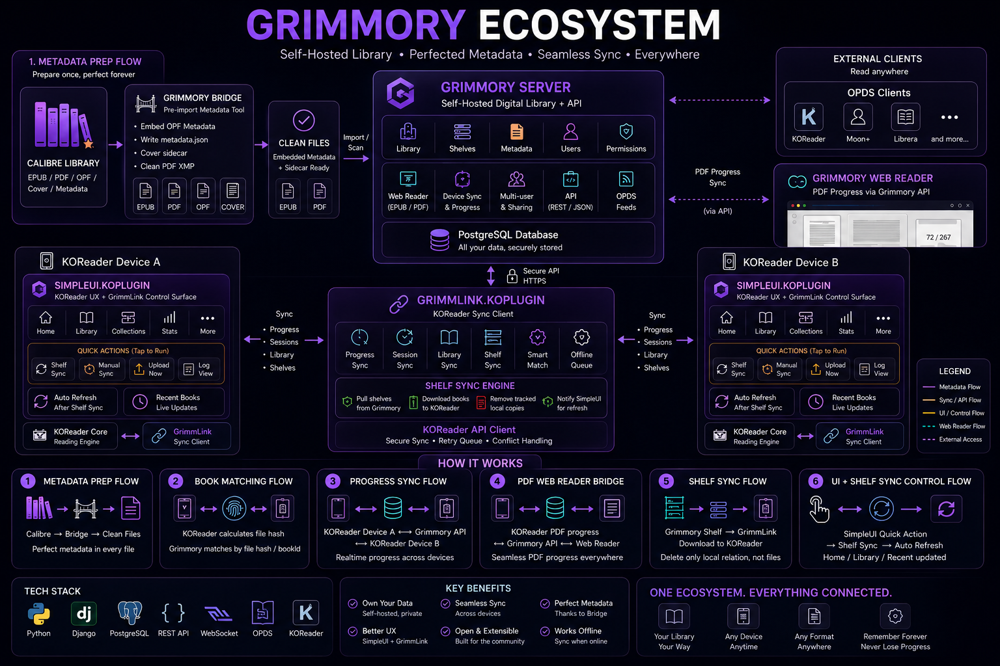
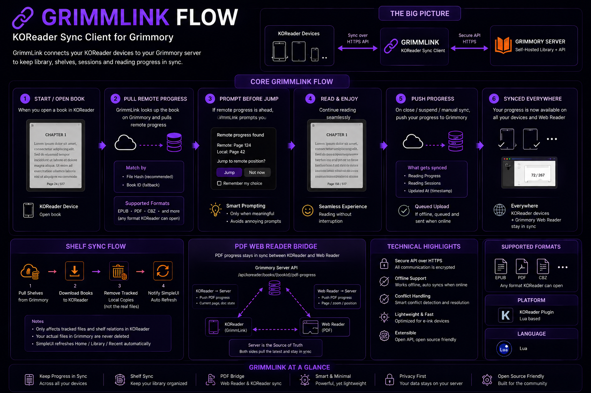

<p align="center">
  <h1 align="center">GrimmLink</h1>
  <p align="center">KOReader companion plugin for <a href="https://github.com/0xstillb/grimmory">Grimmory Fork by 0xStillb</a></p>
</p>

> **Requires [Grimmory](https://github.com/0xstillb/grimmory)** -- a self-hosted book server with KOReader sync API. GrimmLink is designed exclusively for Grimmory.

<p align="center">
  
  
  
  
</p>

---

## Grimmory Ecosystem

<p align="center">
  
</p>

---

## GrimmLink Flow

<p align="center">
  
</p>

---

## What is GrimmLink?

GrimmLink syncs your reading progress, sessions, and library between [KOReader](https://koreader.rocks/) and [Grimmory Fork by 0xStillb](https://github.com/0xstillb/grimmory) server. It supports EPUB, PDF, CBZ, and other KOReader-compatible formats.

### Key Features

- **Progress Sync** -- Pull remote progress on book open, push on close/suspend. You are always prompted before jumping to a remote position.
- **PDF Web Reader Bridge** -- Sync PDF page positions between KOReader and Grimmory's web reader (optional, disabled by default).
- **Reading Sessions** -- Track and upload reading sessions with offline replay for failed uploads.
- **Shelf Sync** -- Download books from Grimmory shelves with progress bar, async/blocking fallback, and large file support.
- **Metadata Sync (Upload-Only)** -- Extract and batch-upload KOReader rating, highlights/notes, and bookmarks to Grimmory via one metadata endpoint.
- **Per-Book Tracking Control** -- Disable/enable GrimmLink tracking for individual books without deleting existing queued or cached data.
- **Debug & Maintenance Tools** -- Export redacted debug info, rotate/cleanup local logs, and clear logs from Maintenance.
- **Auto Update** -- In-app updater with opt-in startup checks.

---

## Installation

1. Download `grimmlink.koplugin.zip` from the [latest release](https://github.com/0xstillb/grimmlink/releases/latest).
2. Extract into KOReader's `plugins/` directory.
3. Restart KOReader.
4. Open **Tools > GrimmLink** and configure:
   - Grimmory Server URL
   - KOReader Username
   - Password
5. Run **Test Connection** to verify.

> **Optional UI Enhancement** -- Install [SimpleUI](https://github.com/0xstillb/simpleui.koplugin) for a polished KOReader home screen with quick GrimmLink actions (Shelf Sync, Manual Sync, Upload Now, Log View).

> The plugin generates `x-auth-key` internally from your password. You never need to enter an auth key, token, or MD5 hash.

---

## Configuration

| Setting | Default | Description |
|---|---|---|
| `pdf_web_reader_bridge_enabled` | `false` | Enable PDF-only Web Reader Bridge |
| `sync_regular_shelf_enabled` | `false` | Enable regular shelf sync target |
| `selected_regular_shelf_id` | `nil` | Selected regular shelf id |
| `sync_magic_shelf_enabled` | `false` | Enable magic shelf sync target |
| `selected_magic_shelf_id` | `nil` | Selected magic shelf id |
| `use_separate_magic_download_dir` | `false` | Use dedicated folder for magic shelf downloads |
| `magic_download_dir` | `""` | Magic shelf download folder when separate-dir mode is enabled |
| `two_way_shelf_delete_sync` | `false` | Mirror tracked shelf deletions into local cleanup |
| `delete_sdr_on_book_delete` | `false` | Remove `.sdr` sidecars when deleting a tracked book |
| `auto_update_enabled` | `false` | Allow in-app updater to install updates |
| `check_update_on_startup` | `false` | Check for updates during startup |
| `ask_wifi_before_sync` | `true` | Ask before attempting Wi-Fi enable/connect when manual sync is started offline |
| `sync_on_network_connected` | `false` | Optionally run pending sync on resume/network return |
| `network_sync_cooldown_seconds` | `300` | Cooldown between automatic resume/network pending sync runs |
| `metadata_sync_enabled` | `false` | Enable metadata upload batches (rating/highlights/bookmarks) |
| `rating_sync_enabled` | `true` | Include KOReader rating items in metadata batches |
| `annotations_sync_enabled` | `true` | Include highlights/notes in metadata batches |
| `bookmarks_sync_enabled` | `true` | Include bookmarks in metadata batches |

---

## How It Works

### Progress Sync (all formats)

```
KOReader Device A ──push──> Grimmory Server <──pull── KOReader Device B
```

- Pulls remote progress when a book opens
- Prompts before jumping to newer remote progress
- Pushes local progress on close, suspend, or manual sync
- Queues failed uploads for later replay

### PDF Web Reader Bridge

```
KOReader ──push──> Grimmory Server <──push── Grimmory Web Reader
    |                                              |
    <──────────── pull (prompted) ─────────────────>
```

- Only runs for PDF files
- Uses `/api/koreader/books/{bookId}/pdf-progress`
- Requires **Sync with Grimmory Reader** enabled in Grimmory web settings

### Metadata Sync (Upload-Only)

- Extracts KOReader metadata from DocSettings into a local pending queue
- Groups pending metadata by book identity and submits one batch request to:
  - `/api/koreader/syncs/metadata`
- Uses KOReader companion auth headers only:
  - `x-auth-user`
  - `x-auth-key`
- Per-item response handling:
  - `synced`, `duplicate`, `updated` -> clear pending row and mark synced history
  - `failed` / `skipped` -> keep pending with retry policy
  - `invalid` -> drop pending row with safe log

### Metadata Sync Limitations (Current Phase)

- Upload-only: GrimmLink -> Grimmory
- No pull-back of annotations/bookmarks/notes to KOReader yet
- No deletion sync semantics in this phase
- Missing metadata in later payloads does not trigger server-side deletions

### Privacy Notes

- GrimmLink does not log full highlight text, full note text, bookmark notes payloads, password, `x-auth-key`, tokens, or Authorization values.
- Logs are limited to operational diagnostics (counts, statuses, dedupe prefixes, and ids).

### Shelf Sync

- Supports both **Regular Shelves** and **Magic Shelves** via KOReader shelf APIs
- Shelf picker groups shelves into **Regular Shelves** and **Magic Shelves**
- Downloads shelf books to local storage with visual progress bar
- **Async download** (curl/wget subprocess) on devices that support it -- non-blocking UI
- **Blocking fallback** (LuaSocket) for devices without curl/wget (e.g. iReader) -- with per-second progress updates
- Handles large files (200MB+) with auto-scaled timeouts and cancellation support
- Same book across multiple synced shelves is reused locally (no duplicate download)
- Removing/disappearing from one shelf removes that shelf mapping only; local file is kept while another shelf still tracks it
- Optional separate Magic Shelf download directory
- Only removes local files that GrimmLink downloaded and tracked
- Never deletes Grimmory library files or server records
- Magic Shelf remove operations may be unsupported by backend (rule-based shelf behavior)

---

## Diagnostics

- `Status / About -> Export GrimmLink Debug Info` exports a redacted runtime summary.
- `Status / About -> Preview Metadata` shows local metadata extraction counts and pending queue totals.
- `Settings -> Metadata Sync -> Sync Metadata Now` runs immediate extract + upload-only sync for the current document.
- `Settings -> Maintenance -> Show DB Status / Pending Counts` shows local queue/tombstone/map counters.

## Maintenance / Data Management

`Settings -> Maintenance` includes local-only cleanup and recovery helpers:

- Clear logs
- Export GrimmLink Debug Info
- Clear pending progress queue
- Clear pending session queue
- Clear pending metadata queue
- Clear synced metadata history (local dedupe history only)
- Clear shelf tombstones
- Clear pending shelf removals
- Rebuild SimpleUI metadata cache
- Rebuild metadata queue for current book
- Force metadata resync for current book
- Re-match current book
- Show DB status / pending counts

All destructive local actions use confirmation prompts. None of these actions delete Grimmory server/library files.

## Manual Reading Status

- `Tools -> GrimmLink -> Manual Reading Status` exposes backend-supported status actions.
- Menu labels include:
  - Mark as Reading
  - Mark as Read
  - Mark as Unread
  - Mark as On Hold
  - Mark as Abandoned
  - Mark as Re-reading
- Unsupported statuses are hidden automatically based on backend capability response.
- When setting `READ`, backend preserves sane `dateFinished` behavior.

## Private Shelf by ID

- `Shelf Sync -> Add Shelf by ID` validates accessibility first, then saves the shelf mapping.
- `Shelf Sync -> Validate Shelf ID` checks access without saving.
- You can choose `regular` or `magic` type before validation.
- Inaccessible shelves are rejected with clear messages, and no hidden shelf data is exposed.

## Download Safety

- Shelf downloads now perform conservative per-book free-space checks when file size is available.
- If free space is insufficient, the book is skipped with a clear warning and sync continues with remaining books.
- If disk-space APIs are unavailable, GrimmLink logs a safe warning and proceeds with existing download behavior.

## Update Safety

- Auto-update is pinned to `0xstillb/grimmlink`.
- Update install preserves KOReader data outside the plugin folder, including:
  - settings and database state
  - logs (unless manually cleared)
  - pending progress/session/metadata queues
  - synced metadata history
  - shelf mappings and tombstones
  - custom download directory settings
- Backups are created before replacing plugin code.

Recommended update practice:

1. Export GrimmLink Debug Info before updating.
2. Keep at least one device-level backup/snapshot.
3. If needed, restore from the most recent GrimmLink backup and restart KOReader.

## Delete Policy

- GrimmLink only deletes local files that it downloaded and tracks.
- If a book remains tracked by another synced shelf, local files are preserved.
- GrimmLink does not delete Grimmory server/library records or files.

## Known Limitations

- Metadata sync is upload-only in this phase.
- Annotation/bookmark deletion sync is deferred.
- Pull-back of annotations/bookmarks/notes to KOReader is deferred.
- Full Thai/English locale pack coverage is deferred (strings are `_()` / `T()` ready).

## Project Structure

```
grimmlink.koplugin/
  main.lua                  # Plugin entry point and UI
  grimmlink_api_client.lua  # HTTP client for Grimmory API
  grimmlink_database.lua    # Local SQLite storage
  grimmlink_shelf_sync.lua  # Shelf download and cleanup
  grimmlink_updater.lua     # In-app update mechanism
  plugin_version.lua        # Version metadata
  _meta.lua                 # KOReader plugin descriptor
  test/                     # Unit tests
docs/                       # Documentation site (Zola)
```

---

## Branch Structure

| Branch | Purpose |
|---|---|
| `main` | Production branch, all releases are tagged here |
| `idea/*` | Experimental / concept branches |
| `archive/*` | Historical branches kept for reference |
| `backup` | Snapshot of previous codebase |

---

## Credits

GrimmLink is a fork of [BookLoreSync](https://github.com/WorldTeacher/BookLoreSync-plugin) by WorldTeacher.

---

## License

See [LICENSE](LICENSE) for details.
